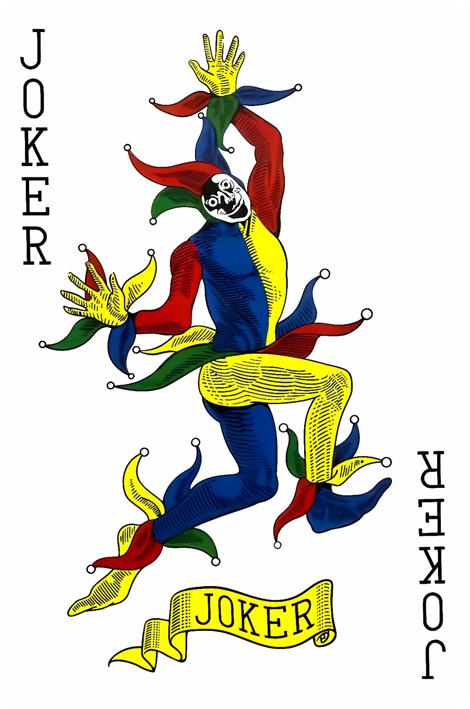

# Welcome to the Borderlands
## A project proposal by Erin Janina Purisima and Janina Marie Tuddao

**Logo:**

## Description:
The website explores **Alice in Borderland**, a Japanese survival thriller Netflix adaptation series directed by Shinsuke Sato from a manga originally written and illustrated by Haro Aso. Alice in Borderland follows a group of people who are transported to a parallel, deserted Tokyo called the *Borderland* where they must play dangerous, life-or-death games to survive.

## Website Outline:
**Home Page:** The home page will contain a short description about Alice in Borderland and a menu represented by card symbols that leads to the other webpages.
**Page 1 (Hearts):** This page will discuss the games and characters who are specialists of the Hearts games.
**Page 2 (Diamonds):** This page will discuss the games and characters who are specialists of the Diamonds games.
**Page 3 (Clubs):** This page will discuss the games and characters who are specialists of the Clubs games.
**Page 4 (Spades):** This page will discuss the games and characters who are specialists of the Spades games.