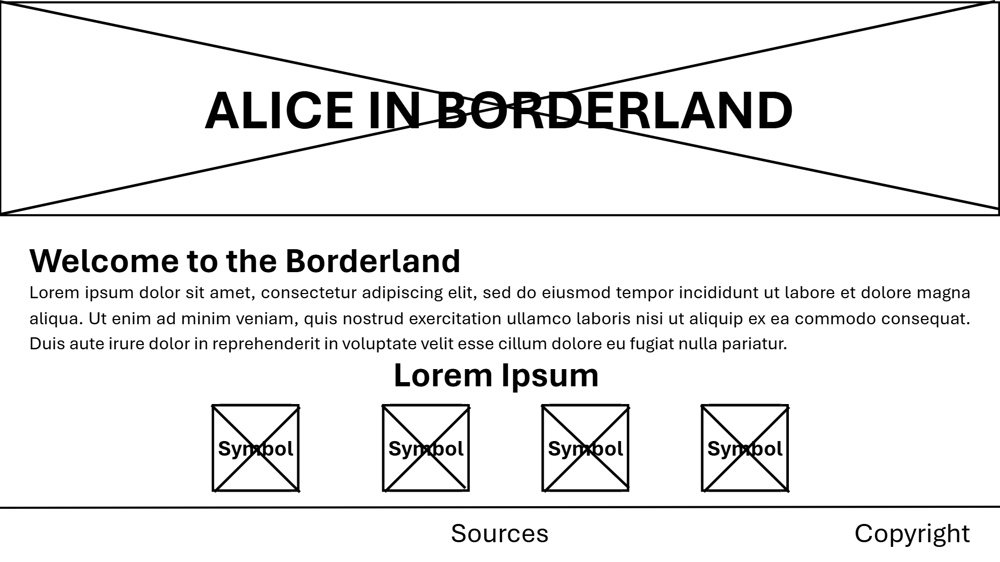
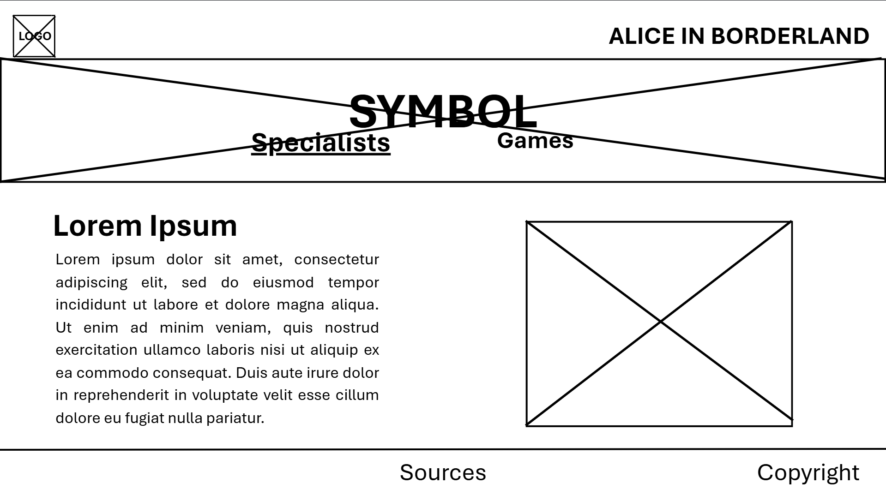
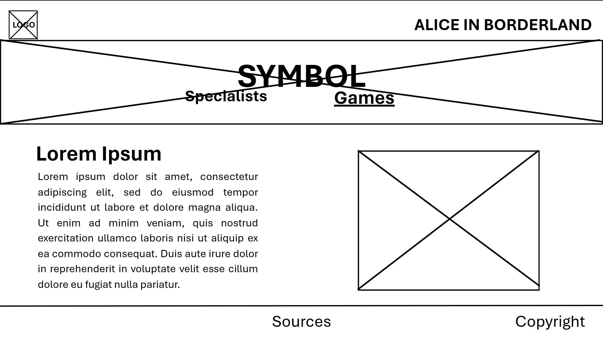
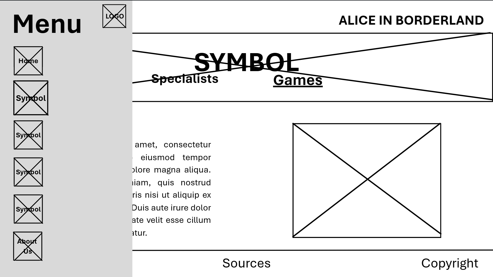
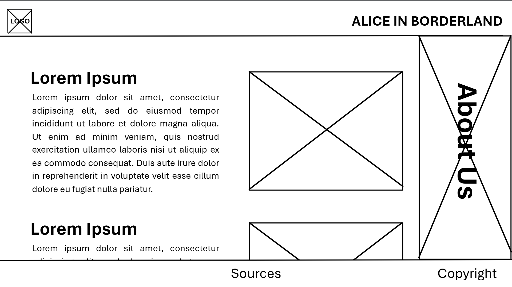

# Welcome to the Borderlands
## A project proposal by Erin Janina Purisima and Janina Marie Tuddao

**Logo:**

**Wiki, C. T. a. I. B. (n.d.). Joker. Alice in Borderland Wiki. https://aliceinborderland.fandom.com/wiki/Joker?file=Joker_%28Netflix_Card_Design%29.png**

## Description
The website explores **Alice in Borderland**, a Japanese survival thriller Netflix adaptation series directed by Shinsuke Sato from a manga originally written and illustrated by Haro Aso. Alice in Borderland follows a group of people who are transported to a parallel, deserted Tokyo called the *Borderland* where they must play dangerous, life-or-death games to survive.

## Website Outline
**Home Page:** The home page will contain a short description about Alice in Borderland and a menu represented by card symbols that leads to the other webpages.

**Page 1 (Hearts Specialists):** This page will discuss the characters who are specialists of the Hearts games.

**Page 1.5 (Hearts Games):** From the page of the specialists, there will be a button that leads to the page that explores the Hearts games themselves.

**Page 2 (Diamonds Specialists):** This page will discuss the games and characters who are specialists of the Diamonds games.

**Page 2.5 (Diamonds Games):** The original page will lead to this that discusses the overall mechanics and winning conditions of the Diamonds games.

**Page 3 (Clubs Specialists):** This page will discuss the games and characters who are specialists of the Clubs games.

**Page 3.5 (Clubs Games):** This webpage will talk about the known Clubs games in the series.

**Page 4 (Spades):** This page will discuss the games and characters who are specialists of the Spades games.

**Page 4.5 (Spades Games):** This is about the mechanics, solutions, and outcomes of the Spades Games.

**About Us:** This page will show information about the authors and their messages to the readers of the website.

All *game webpages* are also going to include the season and episode number where the said game is featured.

## Wireframes
**Home Page:**

**Page 1,2,3,4 (Symbol Specialists):**

**Page 1.5,2.5,3.5,4.5 (Symbol Games):**

**Page 1-5 Expanded (Menu):**

**About Us:**

